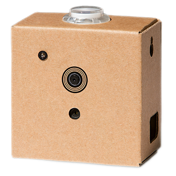

# Vision Kit overview



The AIY Vision Kit is a do-it-yourself intelligent camera built with a
Raspberry Pi and the Vision Bonnet.

After you assemble the kit and run the included demos,
you can extend the kit with your own software and hardware.

Also see the [Vision Kit assembly guide](
https://aiyprojects.withgoogle.com/vision/).

## Software

To execute ML models and perform other actions with the Vision Kit, the
system image includes the Python library with the following modules:

* [`aiy.toneplayer`](aiy.toneplayer.html):
A simple melodic music player for the piezo buzzer.
* [`aiy.trackplayer`](aiy.trackplayer.html):
A tracker-based music player for the piezo buzzer.
* [`aiy.vision.annotator`](aiy.vision.annotator.html):
An annotation library that draws overlays on the Raspberry Pi’s camera preview.
* [`aiy.vision.inference`](aiy.vision.inference.html):
An inference engine that communicates with the Vision Bonnet from the Raspberry
Pi side.
* [`aiy.vision.models`](aiy.vision.models.html):
A collection of modules that perform ML inferences with specific types of image
classification and object detection models.
* [`aiy.board`](aiy.board.html):
APIs to use the button that’s attached to the Vision Bonnet’s button connector.
* [`aiy.leds`](aiy.leds.html):
APIs to control certain LEDs, such as the LEDs in the button and the privacy
LED.
* [`aiy.pins`](aiy.pins.html):
Pin definitions for the bonnet's extra GPIO pins, for use with gpiozero.


## Vision Bonnet

### Hardware

* SOC: `Myriad 2450`
* MCU: `ATSAMD09D14` [I&sup2;C address: `0x51`]
* LED Driver: `KTD2027A` [I&sup2;C address: `0x30`]
* Crypto (optional): `ATECC608A` [I&sup2;C address: `0x60`]
* IMU: `BMI160`

### Drivers

* MCU driver: `modinfo aiy-io-i2c`
* MCU PWM driver: `modinfo pwm-aiy-io`
* MCU GPIO driver: `modinfo gpio-aiy-io`
* MCU ADC driver: `modinfo aiy-adc`
* LED driver: `modinfo leds-ktd202x`
* Software PWM driver for buzzer: `modinfo pwm-soft`
* Myriad driver: `modinfo aiy-vision`

To reset MCU:
```
echo 1 | sudo tee /sys/bus/i2c/devices/1-0051/reset
```

To get MCU status message (including firmware version) and last error code:
```
cat /sys/bus/i2c/devices/1-0051/{status_message,error_code}
```

### Pinout (40-pin header)

```
                   3.3V --> 1    2 <-- 5V
                I2C_SDA --> 3    4 <-- 5V
                I2C_SCL --> 5    6 <-- GND
                            7    8
                    GND --> 9   10
                            11  12
                            13  14 <-- GND
  (GPIO_22) BUZZER_GPIO --> 15  16 <-- BUTTON_GPIO (GPIO_23)
                   3.3V --> 17  18
               SPI_MOSI --> 19  20 <-- GND
               SPI_MISO --> 21  22
               SPI_SCLK --> 23  24 <-- SPI_CE_MRD
                    GND --> 25  26
                 ID_SDA --> 27  28 <-- ID_SCL
                            29  30 <-- GND
          PI_TO_MRD_IRQ --> 31  32
          MRD_TO_PI_IRQ --> 33  34 <-- GND
                            35  36
             MRD_UNUSED --> 37  38
                    GND --> 39  40
```

Also see the [Vision Bonnet on pinout.xyz](https://pinout.xyz/pinout/aiy_vision_bonnet).

## Troubleshooting

See the [Vision Kit help](https://aiyprojects.withgoogle.com/help#vision-kit).
