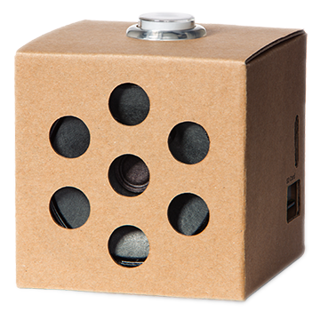

# Voice Kit overview



The AIY Voice Kit is a do-it-yourself intelligent speaker built with a
Raspberry Pi and the Voice Bonnet (or Voice HAT if using the V1 Voice Kit).

After you assemble the kit and run the included demos,
you can extend the kit with your own software and hardware.

Also see the [Voice Kit assembly guide](https://aiyprojects.withgoogle.com/voice/).

## Software

To interact with the Google Assistant, convert speech to text, and perform other
actions with the Voice Kit, the system image includes Python library with the
following modules:

* [`aiy.assistant`](aiy.assistant.html):
A collection of modules that simplify interaction with the Google Assistant API.
* [`aiy.cloudspeech`](aiy.cloudspeech.html):
APIs to simplify interaction with the Google Cloud Speech-to-Text service.
* [`aiy.voice.audio`](aiy.voice.audio.html):
APIs to record and play audio files.
* [`aiy.voice.tts`](aiy.voice.tts.html):
An API that performs text-to-speech.
* [`aiy.board`](aiy.board.html):
APIs to use the button that’s attached to the Voice Bonnet’s button connector.
* [`aiy.leds`](aiy.leds.html):
APIs to control certain LEDs, such as the LEDs in the button and the privacy
LED.
* [`aiy.pins`](aiy.pins.html):
Pin definitions for the bonnet's extra GPIO pins, for use with gpiozero.

## Voice Bonnet (Voice Kit V2)

### Hardware

* Audio Codec: `ALC5645` [I&sup2;C address: `0x1A`]
* MCU: `ATSAMD09D14` [I&sup2;C address: `0x52`]
* LED Driver: `KTD2027B` [I&sup2;C address: `0x31`]
* Crypto (optional): `ATECC608A` [I&sup2;C address: `0x62`]
* Microphone: `SPH1642HT5H-1` x 2

### Drivers

* MCU driver: `modinfo aiy-io-i2c`
* MCU PWM driver: `modinfo pwm-aiy-io`
* MCU GPIO driver: `modinfo gpio-aiy-io`
* MCU ADC driver: `modinfo aiy-adc`
* LED driver: `modinfo leds-ktd202x`
* Software PWM driver for buzzer: `modinfo pwm-soft`
* Sound drivers: `modinfo rl6231 rt5645 snd_aiy_voicebonnet`

### Pinout (40-pin header)

```
       3.3V --> 1    2 <-- 5V
                3    4 <-- 5V
                5    6 <-- GND
                7    8
        GND --> 9   10
                11  12 <-- I2S_BCLK
                13  14 <-- GND
                15  16 <-- BUTTON_GPIO (GPIO_23)
       3.3V --> 17  18
                19  20 <-- GND
                21  22 <-- LED_GPIO (GPIO_25)
                23  24
        GND --> 25  26
     ID_SDA --> 27  28 <-- ID_SCL
                29  30 <-- GND
                31  32
                33  34 <-- GND
  I2S_LRCLK --> 35  36 <-- AMP_ENABLE
                37  38 <-- I2S_DIN
        GND --> 39  40 <-- I2S_DOUT
```

Also see the [Voice Bonnet on pinout.xyz](https://pinout.xyz/pinout/aiy_voice_bonnet).


## Voice HAT (Voice Kit V1)

### Hardware

* Audio Amplifier: `MAX98357A`
* Microphone: `ICS-43432` x 2

### Schematics

* [Main Board](https://github.com/google/aiyprojects-raspbian/blob/aiyprojects/schematics/voice_hat/voice_hat.pdf)
* [Microphone Board](https://github.com/google/aiyprojects-raspbian/blob/aiyprojects/schematics/voice_hat/voice_hat_mic.pdf)

### Drivers

* [googlevoicehat-codec.c](https://github.com/raspberrypi/linux/blob/rpi-4.14.y/sound/soc/bcm/googlevoicehat-codec.c)
* [googlevoicehat-soundcard.c](https://github.com/raspberrypi/linux/blob/rpi-4.14.y/sound/soc/bcm/googlevoicehat-soundcard.c)
* [googlevoicehat-soundcard-overlay.dts](https://github.com/raspberrypi/linux/blob/rpi-4.14.y/arch/arm/boot/dts/overlays/googlevoicehat-soundcard-overlay.dts)

Manual overlay load:
```
sudo dtoverlay googlevoicehat-soundcard
```

Load overlay on each boot:
```
echo "dtoverlay=googlevoicehat-soundcard" | sudo tee -a /boot/config.txt
```

### Pinout (40-pin header)

```
       3.3V --> 1    2 <-- 5V
    I2C_SDA --> 3    4 <-- 5V
    I2C_SCL --> 5    6 <-- GND
                7    8
        GND --> 9   10
                11  12 <-- I2S_BCLK
                13  14 <-- GND
                15  16 <-- BUTTON_GPIO (GPIO_23)
       3.3V --> 17  18
                19  20 <-- GND
                21  22
                23  24
        GND --> 25  26
     ID_SDA --> 27  28 <-- ID_SCL
                29  30 <-- GND
                31  32
                33  34 <-- GND
  I2S_LRCLK --> 35  36
                37  38 <-- I2S_DIN
        GND --> 39  40 <-- I2S_DOUT
```

Also see the [Voice HAT on pinout.xyz](https://pinout.xyz/pinout/voice_hat).

## Troubleshooting

See the [Voice Kit help](https://aiyprojects.withgoogle.com/help#voice-kit).
